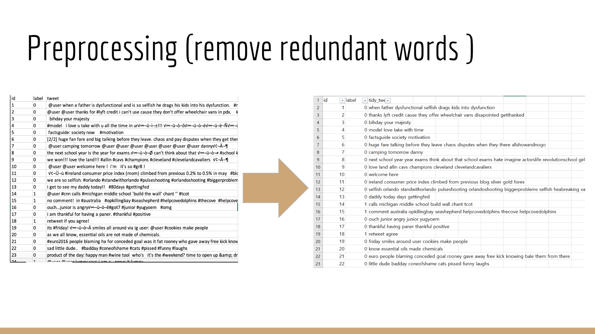
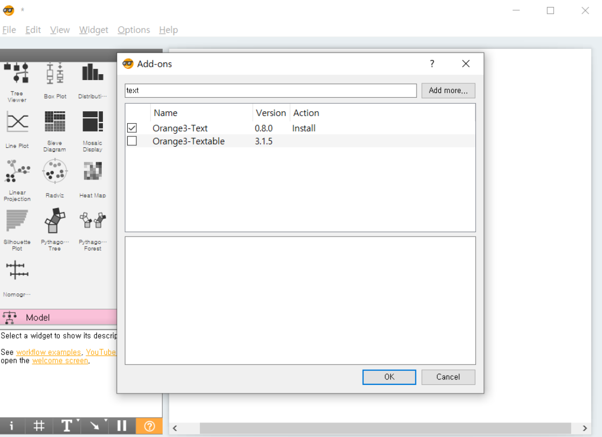
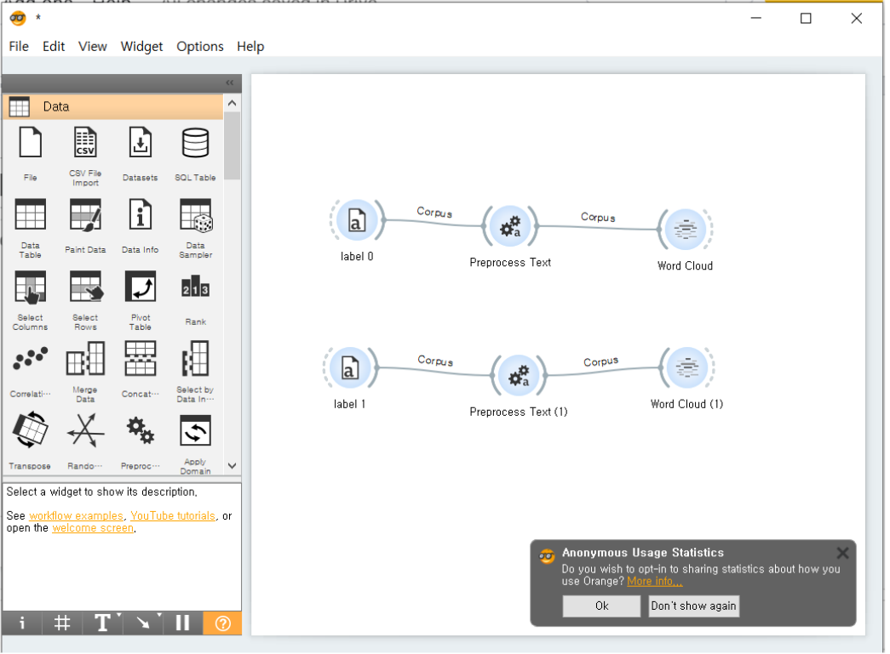
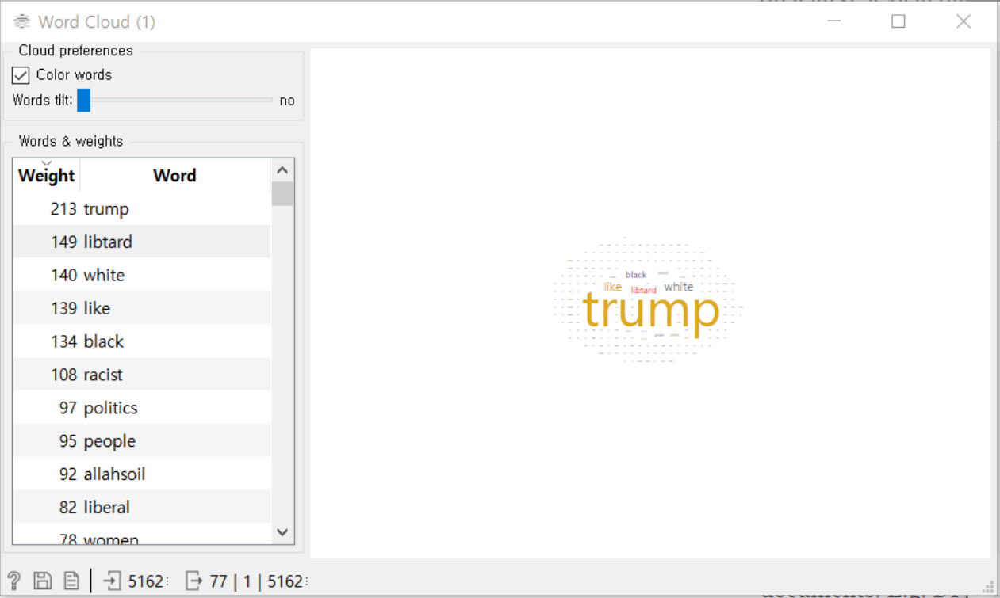
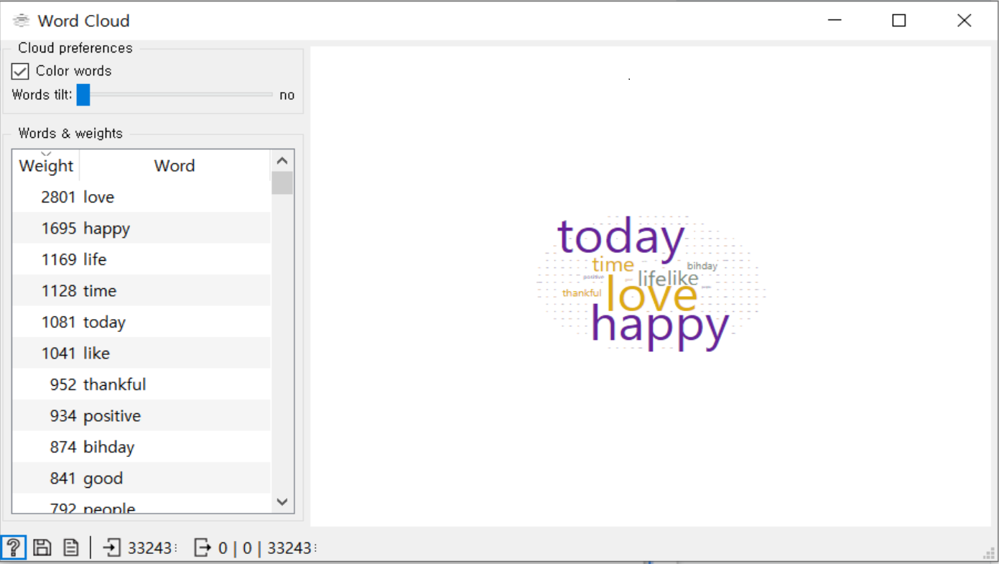
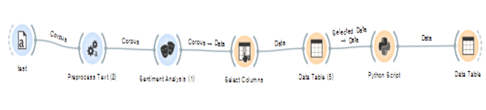
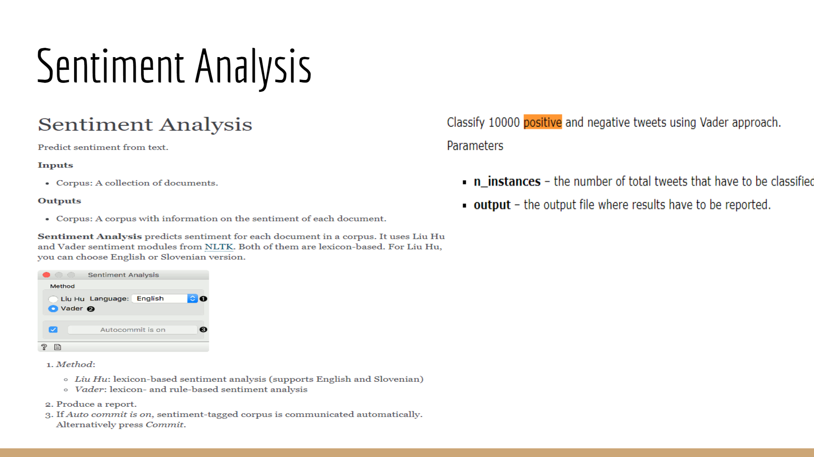
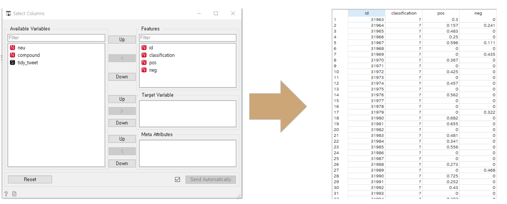
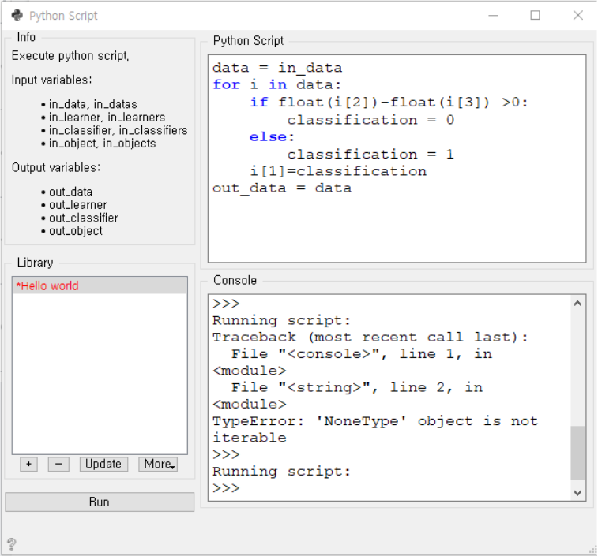
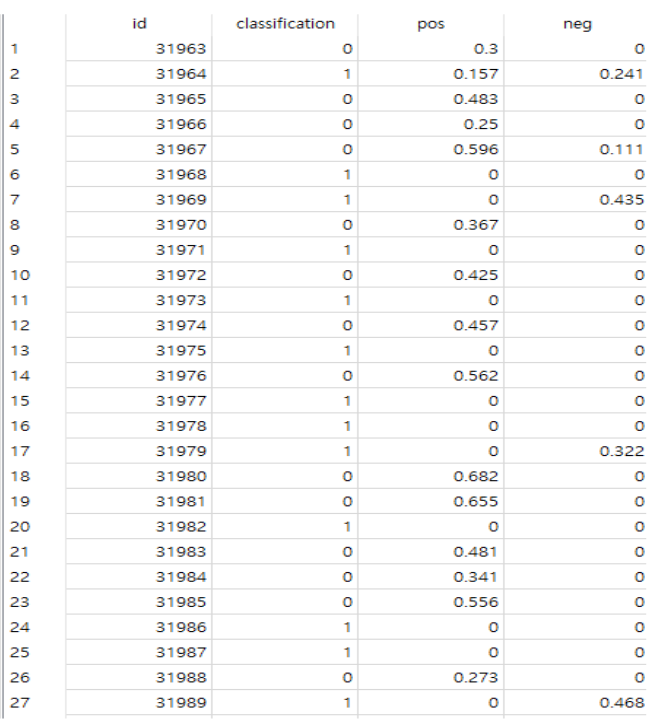

# CSE351_Exercise3  
We solved a data challenge regarding twitter classification as a group project.

## Problem statement  
The objective of this task is to detect hate speech in tweets. For the sake of simplicity, we say a tweet contains hate speech if it has a racist or sexist sentiment associated with it. So, the task is to classify racist or sexist tweets from other tweets.  
Formally, given a training sample of tweets and labels, where label '1' denotes the tweet is racist/sexist and label '0' denotes the tweet is not racist/sexist, your objective is to predict the labels on the test dataset.

## Description of dataset  
The dataset is a .csv file with three colums; tweet id, label and a tweet data.  
* A tweet id is an integer value for identifying each tweets.  
* A label is used for classifying each tweets as love or hate. A tweet is labeled as 0 if it contains racist or sexist comments and 1 if it does not contains racist or sexists comments.  
* A tweet data is string value of tweet comments that users have posted.  

## Approach for solving problem  
We used the following approach to solve the data challenge.  
1. Data processing
2. Classify the train data set by their label
3. Rank the words based on the frequence within each label
4. Input test dataset and analyze each tweet.
5. Classify the tweets based on the ratio of positive words(0) to negative words(1)
6. Make Prediction

## Data Preprocessing and final dataset  
We preprocessed data using tweetPreprocess.py python code. We removed redundant words and modified recurrent words. We considered the word with common etymology as same for more accuarate classification. For example, we considered *programming*, *programmer*, *programmed*, *etc* as same as they have common meaning related to *programming*.  
We created two .csv files which are subdivided by the tweet labels from the main dataset. 

<br/><br/>

## Data analysis tool and procedure
We used orange for the data analysis tool.  
  
<br/><br/>

### First Try
Our first Try: Weight each words based on its frequency and compute scores of each sentences. Based on appearance of higher weighted words, we can classify tweets as love tweet or hate tweet.  
<br/><br/>
Step 1: Install oraged add-ons for preprocessed text.  
  
<br/><br/>
Step 2: Sort the words in frequency.  
  
<br/><br/>
Step 3: Create word cloud / data table for label 0 and 1.  

  
<br/><br/>
Step 4: Weight each words according its frequency.  
We were stuch at this point. We considerd a lot to figure out reasonable weight for each words.    

<br/><br/>
### Second Try
Our second Try: After some research we decided to try sentiment analsis.    
Step 1: Preprocess and analyze test data.  
  
<br/><br/>
Step 2: Sentiment Analysis.  
  
<br/><br/>
Step 3: Select data for classification.  
  
<br/><br/>
Step 4: Write and used python code for classification.  
  

## Classification Pseudocode:  
```  
If pos-neg >0:  
   Classification = "Positive"    
else :  
   Classification = "Negative"  
```
 
## Result Description
Results (Classification)  
Label 0 stands for Positive Tweet  
Label 1 stands for Negative Tweet  
Success!  


## Authors  
Seungjoo Choi  
Wenhui Jin  
Jihee Son
